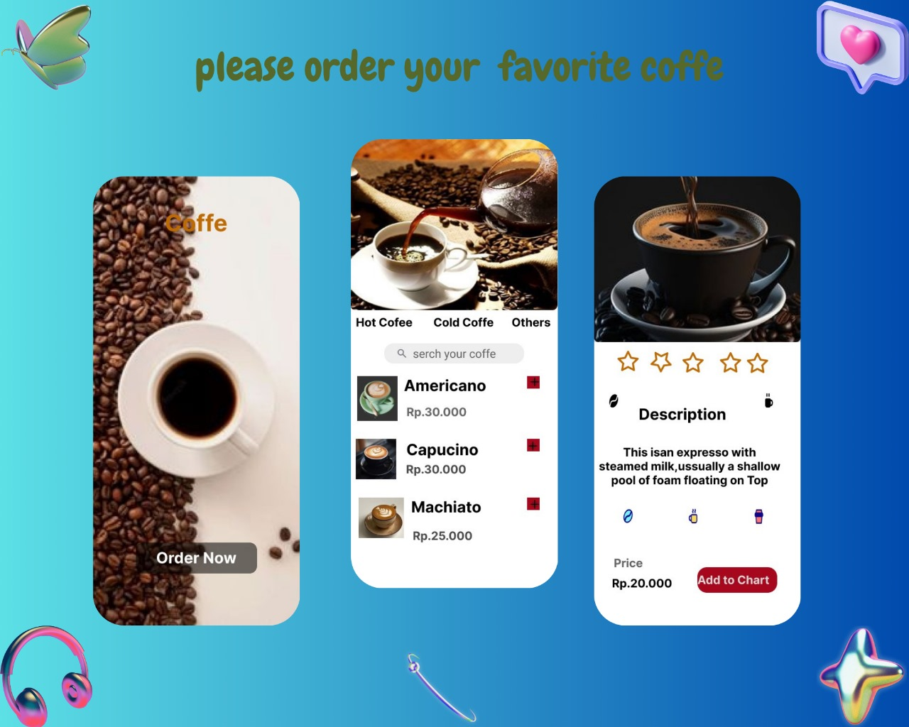

# My Android Studio Project
 
## Deskripsi
Coffee App

## Tampilan Aplikasi

## Cara Menjalankan
1. Clone repository ini.
2. Buka proyek di Android Studio.
3. Jalankan aplikasi pada emulator atau perangkat nyata.
